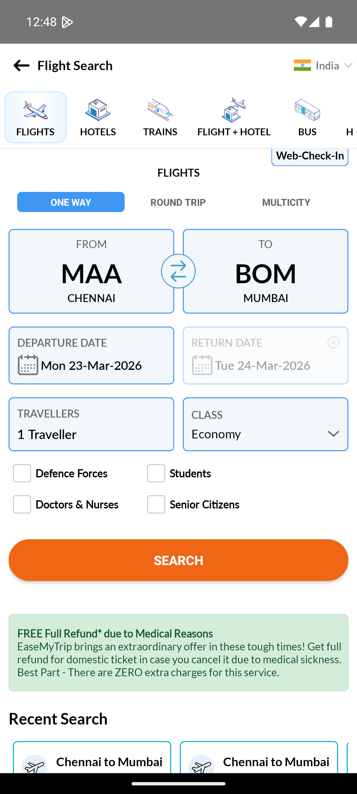

# ✈️ EaseMyTrip Mobile Automation Framework (Appium + AI)

This project is a mobile automation framework for the EaseMyTrip Android application built using Python and Appium.  
It follows the Page Object Model (POM) design pattern and integrates AI-generated test cases for intelligent validation and failure detection.

---

## 📌 Project Overview

This framework automates the flight search functionality of the EaseMyTrip mobile application.

### 🔥 Key Features

- Appium-based mobile automation  
- Page Object Model (POM) design pattern  
- AI-generated test case module for intelligent validation  
- Screenshot capture for failed test cases  
- HTML test reports generation  
- Config-driven framework  
- Git version control  

---

## 🛠 Tech Stack

- Python  
- Appium  
- Selenium  
- PyTest  
- Android Studio  
- Node.js  

---

## 📂 Project Structure

EasyTripAutomation/
├── ai/            # AI-generated test case module
├── config/        # Configuration files
├── pages/         # Page Object Model classes
├── reports/       # HTML test reports
├── screenshots/   # Test screenshots
│   ├── POM_test/      # Manual/POM test screenshots
│   └── ai_failures/   # AI-generated failure screenshots
├── test_data/     # AI test data
├── tests/         # Test scripts
├── utils/         # Driver setup & helpers
├── easemytrip_test.py
├── test_connection.py
└── README.md

---

## ⚙️ Prerequisites

Before running the framework, install:

- Python 3.9+  
- Appium Server  
- Android Studio  
- Android Emulator / Real Device  
- Node.js  

---

## 🚀 How to Run

1. Clone the repository:
git clone https://github.com/jayanth-maker/easemytrip-appium-automation.git  
cd easemytrip-appium-automation  

2. Create virtual environment:
python -m venv venv  
source venv/bin/activate  

3. Install dependencies:
pip install -r requirements.txt  

4. Start Appium server  

5. Run tests:
pytest tests/  

---

## 📸 Screenshots

### 🔹 POM Test Cases

#### Invalid City Test  

#### Empty Search Test  

---

### 🤖 AI Generated Test Failures

Screenshots for failed AI-generated test cases are stored in:

screenshots/ai_failures/

---

## 📊 Reports

- HTML reports are generated inside the `reports/` folder  
- Provides detailed execution results and logs  

---

## 🎯 Highlights

- Designed using scalable automation architecture (POM)  
- Integrated AI for smart test case generation  
- Handles real-world scenarios like invalid inputs and edge cases  
- Clean folder structure for maintainability  

---

## 👨‍💻 Author

Jayanth Nandakumar  

---

## ⭐ If you like this project, give it a star!
